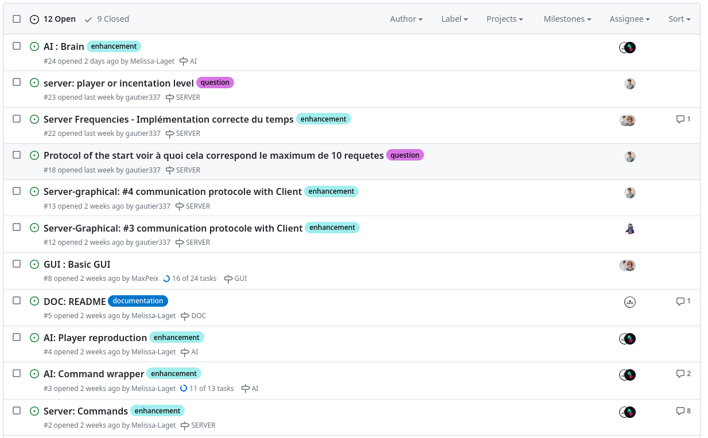

# Zappy project :video_game:

## Done by Melissa, Maxime, Gauthier, Hugo, Max and Nicolas - Epitech 2023 :mortar_board:

### Overview :eyes:

This project is a part of the **second** year of Epitech. <br>
We had **1 month** to complete it. :spiral_calendar: <br>

The goal of this project was to create a **game** in **C++**, **C** and **python**. :pizza:<br>

[//]: # (Talk about the features of the game)
[//]: # (Talke about the architecture of the project)

### Running the project locally :building_construction:

> **Warning**
>
> Make sure you have **CMake** and the **SFML** library installed on your computer.
> <br>
> If you don't, the project will **not compile**. <br>

* Clone this repository locally
* Create a folder `build` at the root of the repository
* Go in it and run the command `cmake ..`
* Then you can do a `make`
* And run `./zappy_<server|ai|gui> <options>`

[//]: # (Put the different commands to run the project)

To try this program, you can to use this **command**: :computer: <br>

```bash
mkdir -p build && cd build && cmake .. && make && ./zappy<server|ai|gui> <options>
```

There are 3 binaries in this project: <br>
- `zappy_server` : the server of the game
Where the **options** are:
  - `-p` : the port of the server
  - `-x` : the width of the map
  - `-y` : the height of the map
  - `-n` : the name of the teams
  - `-c` : the number of clients allowed at the same time on the server on the same team (default: 2)
  - `-f` : the frequency of the server (default: 2)
- `zappy_ai` : the AI of the game
Where the **options** are:
  - `-p` : the port of the server
  - `-h` : the name of the machine; `localhost` by default
- `zappy_gui` : the graphic interface of the game
Where the **options** are:
  - `-p` : the port of the server
  - `-n` : the name of the teams
  - `-h` : the name of the machine; `localhost` by default

In example, you can run the server with this command: <br>
```bash
./zappy_server -p 8000 -x 10 -y 10 -n team1 team2 -f 2
```

Or, you can run the AI with this command: <br>
```bash
./zappy_ai -p 8000
```

Or, you can run the graphic interface with this command: <br>
```bash
./zappy_graphic -p 8000 -n team1
```

The goal of the game is to have all your team elevate to level 6. <br>
To do that, you have to collect resources and elevate yourself. <br>
You can collect resources by moving on it and then take it. <br>
You can elevate yourself by collecting resources and then do an `incantation`. <br>
You have to *be careful* because you can die if you don't have enough food. <br>
You can also comunicate with other players by sending messages using the `broadcast <msg>` command. <br>

The different commands you can use are: <br>
- `Forward` : move forward
- `Right` : turn right
- `Left` : turn left
- `Look` : look around you
- `Inventory` : look at your inventory
- `Broadcast <msg>` : send a message to all players
- `Connect_nbr` : look at the number of clients allowed on the server on the same team
- `Take <resource>` : take a resource on the ground
- `Set <resource>` : set a resource on the ground
- `Eject` : eject all players on the same tile including eggs
- `Fork` : lay an egg
- `Incantation` : start an incantation to elevate yourself to the next level

[//]: # (Put the different output of the commands)

Here is the different resources you can collect: <br>
- `food` : food to eat
- `linemate` : stone to elevate yourself
- `deraumere` : stone to elevate yourself
- `sibur` : stone to elevate yourself
- `mendiane` : stone to elevate yourself
- `phiras` : stone to elevate yourself
- `thystame` : stone to elevate yourself


Here is what you need to elevate yourself from the different levels: <br>
- `level 1 to level 2` : 1 player, 1 linemate, 0 deraumere, 0 sibur, 0 mendiane, 0 phiras, 0 thystame
- `level 2 to level 3` : 2 players, 1 linemate, 1 deraumere, 1 sibur, 0 mendiane, 0 phiras, 0 thystame
- `level 3 to level 4` : 2 players, 2 linemate, 0 deraumere, 1 sibur, 0 mendiane, 2 phiras, 0 thystame
- `level 4 to level 5` : 4 players, 1 linemate, 1 deraumere, 2 sibur, 0 mendiane, 1 phiras, 0 thystame
- `level 5 to level 6` : 4 players, 1 linemate, 2 deraumere, 1 sibur, 3 mendiane, 0 phiras, 1 thystame
- `level 6 to level 7` : 6 players, 1 linemate, 2 deraumere, 3 sibur, 0 mendiane, 1 phiras, 0 thystame
- `level 7 to level 8` : 6 players, 2 linemate, 2 deraumere, 2 sibur, 2 mendiane, 2 phiras, 1 thystame

### Output :outbox_tray:

An **output** you can get from this program can be:


[//]: # (Put screenshots of the game)

### Tools and languages used :hammer_and_wrench:

[](https://github.com/tandpfun/skill-icons)

### Commit norm :keyboard:

Here, you can find our [commit norm](doc/COMMIT.md). :memo:

### Organization :file_folder:
To organize our work, we used a **GitHub project**. <br>
We made **issues** and **branches** to work on the project. <br>
We also made **milestones** to know what we had to do in which part, like the server, the AI or the graphic interface or the documentation. <br>



Here is the link of our [**GitHub project**](https://github.com/orgs/EpitechPromo2026/projects/727). :octocat:

### Our GitHub accounts: :octocat:

* [Maxime SENARD](https://github.com/RedCommand)
* [Melissa LAGET](https://github.com/Ackfire)
* [Gautier Bonhur](https://github.com/gautier337)
* [Hugo DUBOIS](https://github.com/Hugo-code-dev)
* [Max Peixoto](https://github.com/MaxPeix)
* [Nicolas Sainty](https://github.com/nicolas-sainty)

:+1: Thanks for reading this documentation ! :page_facing_up:
